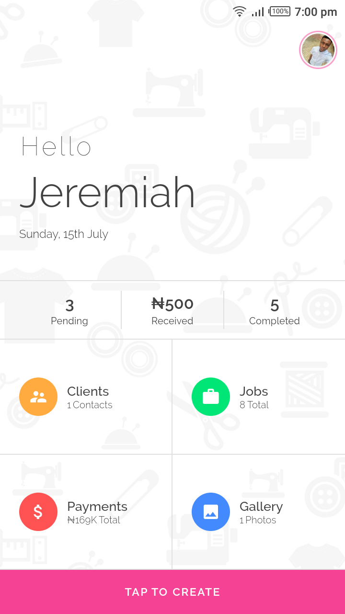
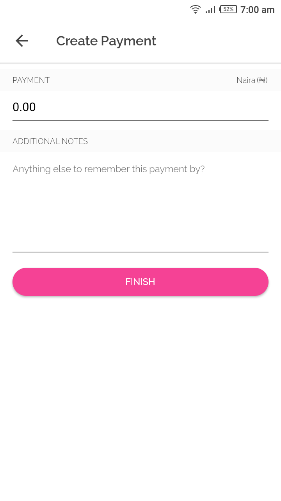
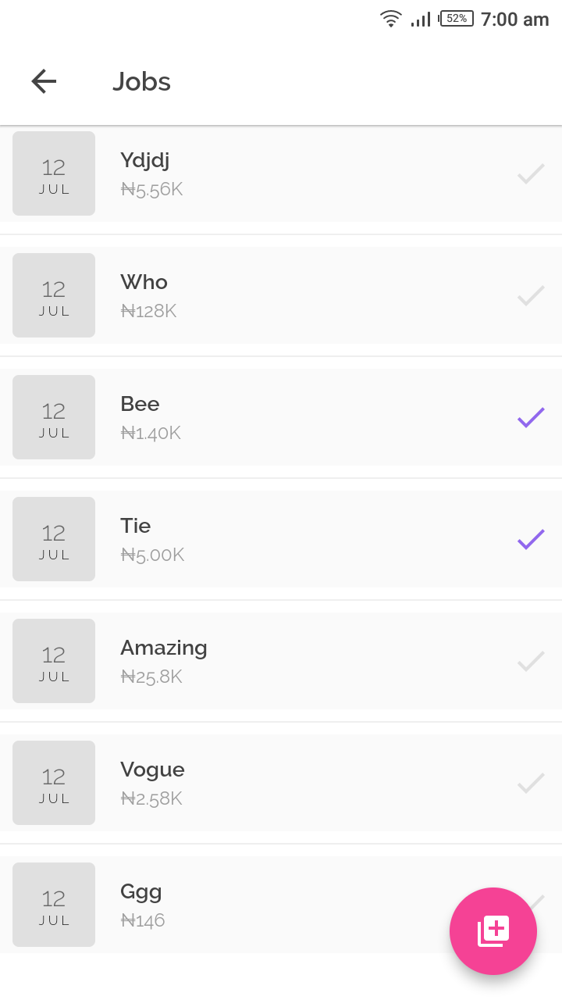

# TailorMade: Managing a Fashion designer's daily routine.

TailorMade is what actually started out as an experiment with [Flutter](https://flutter.io/), [flutter_redux](https://github.com/brianegan/flutter_redux) and [Firebase Cloud Functions](https://github.com/flutter/plugins/tree/master/packages/cloud_functions) but instead turned out to be a valuable tool for managing a Fashion designer's daily routine. It is clean, easy on the eyes and overall has a very smooth feel. It also handles offline use cases with Firebase Cloud. Logo, Design & Concept by Me.

## Tools

1.  Firebase Auth
2.  Firebase Cloud Firestore
3.  Firebase Cloud Functions
4.  Firebase Storage
5.  Google SignIn
6.  RxDart
7.  Flutter Redux
8.  Redux Epics
9.  Image Picker
10. Photo View
11. Cached Network Image
12. Flutter SpinKit
13. Flutter Get Version
14. Flutter Masked Text

For a full description of OSS used, see pubspec.yaml

## UI Shots

  <table>
    <tr>
      <td style="text-align: center">
        
      </td>
      <td style="text-align: center">
        
      </td>
      <td style="text-align: center">
        
      </td>
      <td style="text-align: center">
        
      </td>
      <td style="text-align: center">
        
      </td>
    </tr>
    <tr>
      <td style="text-align: center">
        
      </td>
      <td style="text-align: center">
        
      </td>
      <td style="text-align: center">
        
      </td>
      <td style="text-align: center">
        
      </td>
      <td style="text-align: center">
        
      </td>
    </tr>
    <tr>
      <td style="text-align: center">
        
      </td>
      <td style="text-align: center">
        
      </td>
      <td style="text-align: center">
        
      </td>
      <td style="text-align: center">
        
      </td>
      <td style="text-align: center">
        
      </td>
    </tr>
    <tr>
      <td style="text-align: center">
        
      </td>
      <td style="text-align: center">
        
      </td>
      <td style="text-align: center">
        
      </td>
      <td style="text-align: center">
        
      </td>
      <td style="text-align: center">
        
      </td>
    </tr>
    <tr>
      <td style="text-align: center">
        
      </td>
      <td style="text-align: center">
        
      </td>
    </tr>
  </table>

For help getting started with Flutter, view our online
[documentation](https://flutter.io/).
